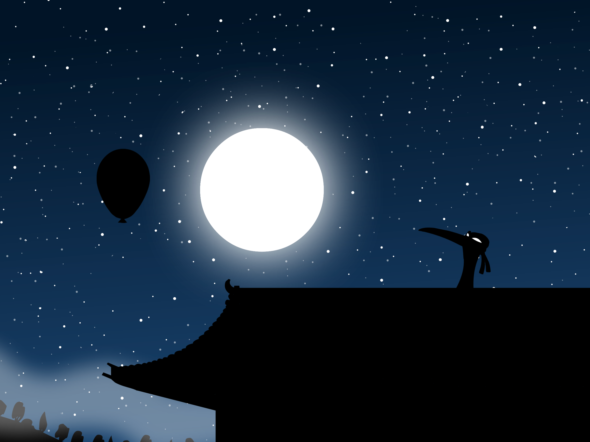

# btd5-restored 

The original **Flash** version of _Bloons Tower Defense 5_ ported to Godot 4!

The main goal of this project is to bring back the old vector artwork that was sadly scrapped in favor of the new png art for the Steam/mobile version of BTD5. It also comes with quality of life features and much better performance than the original flash version.

# Disclaimer

This is an unofficial fan project. It is not endorsed by Ninja Kiwi.
This repository **contains Ninja Kiwi's original Flash assets** (graphics & audio). They have been ripped from the Flash release using [ffdec](https://github.com/jindrapetrik/jpexs-decompiler). I do not own the rights to these assets.
